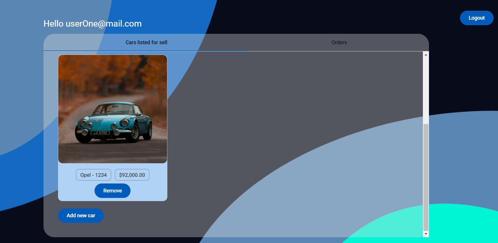
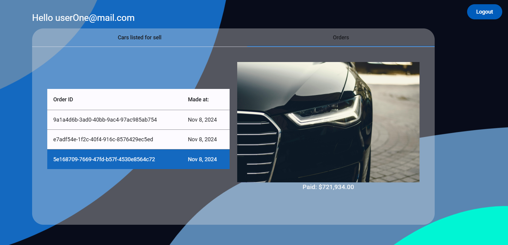

## Car Dealership Application

This application facilitates the buying and selling of cars. It supports two types of users: **guests** and **registered users**.

- **Guests**: Can only view available cars.
- **Registered users**: Can sell or purchase vehicles.

## How to run the server

1. npm install
2. npm run start (If you want to change something and see changes, just run `npm run start:dev`)
3. Run PG Admin to see the database
4. Create a new database called `car_dealership`
5. Copy all properties from `.env.example` to `.env` and change them to your needs

## Using the server

- Api endpoints: `localhost:3000/api`
- Swagger: `localhost:3000/swagger`

Before you start using the endpoints, invoke the following endpoint `api/users/init-users` to initialize users.

## Backfilling the database with data (cars)

Invoke the following endpoint `api/cars/backfill` to backfill the database with data.

You MUST invoke the users endpoint BEFORE you backfill the database with cars, as each car must have a sellerId.

### Using the backfill endpoint

To determine the number of cars to backfill, you can add any number in the count query parameter.
To manually set the userIds (must be existing users), you can add the query parameter `userIds` and pass an array of userIds, which will randomly be set as the sellerId of each car.Here are ids for the two created users. Insert these before invoking the backfill endpoint.
"2a23b510-e5d1-4688-a9d6-01cb92afc87d" and "d65387fe-f156-4e67-9054-66e695dbee1c"

## How to run web

1. npm install
2. npm start
3. Open link in browser

